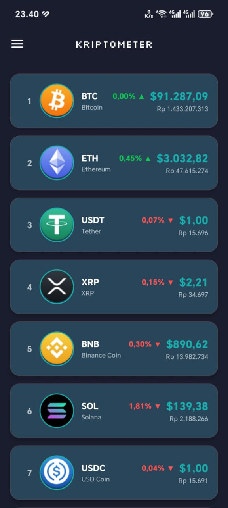
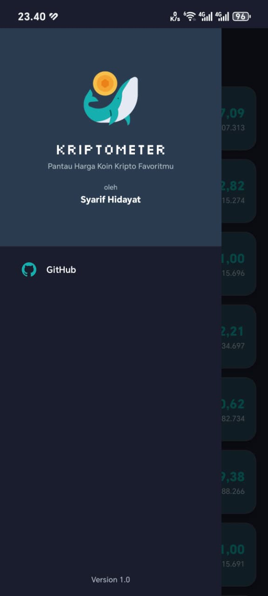

# KriptoMeter

Aplikasi Android untuk menampilkan informasi cryptocurrency real-time.

## 📸 Preview
<p>
  
  
</p>

## ⬇️ Download

Initial release (v1.0) sudah dapat di unduh

[](https://github.com/syarhida/KriptoMeter/releases/tag/v1.0.1)

## 🚀 Fitur

- 📊 Daftar Cryptocurrency Real-time: Menampilkan rank, nama, symbol, harga USD, dan harga IDR dari 100 cryptocurrency teratas.
- 📈 Indikator Perubahan Harga: Color coding hijau untuk kenaikan dan merah untuk penurunan harga dalam 24 jam.
- 🪙 Icon Cryptocurrency: Setiap coin ditampilkan dengan icon circular yang elegan.
- 🌙 Dark Theme Modern: Menggunakan Material Design 3.

## 🛠️ Teknologi

- **Language**: Kotlin
- **Architecture**: MVVM
- **Networking**: Retrofit 2.9.0 + Gson
- **Async**: Kotlin Coroutines
- **UI**: Material Design 3, ViewBinding
- **Min SDK**: 24 (Android 7.0)
- **Target SDK**: 34 (Android 14)

## 📦 Struktur Project

```
com.syarhida.kriptometer/
├── model/
│   ├── Crypto.kt
│   └── CryptoResponse.kt
├── network/
│   ├── ApiService.kt
│   └── RetrofitClient.kt
├── adapter/
│   └── CryptoAdapter.kt
├── viewmodel/
│   └── CryptoViewModel.kt
└── MainActivity.kt
```

## 🌐 API

API Endpoint: 
```
https://api.coinlore.net/api/tickers/
```

## 📝 Lisensi

Project ini dibuat untuk keperluan Tugas 3 Mata Kuliah Pemrograman Berbasis Piranti Bergerak.
